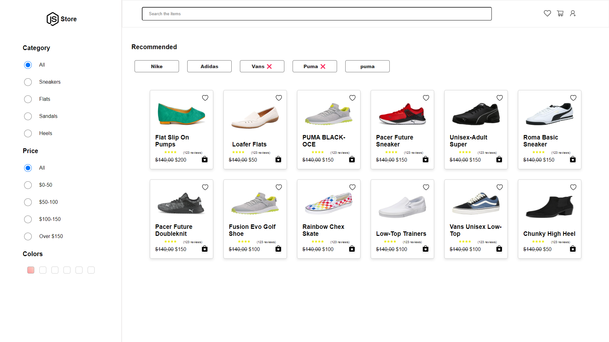

# E-commerce Home Page

<div align="center">
  
</div>

This **E-commerce Home Page** is built using **React.js**. It showcases advanced ES6 filtering techniques and utilizes **useContext** for managing global state effectively. The application is styled using CSS to ensure a modern and responsive design.

## Live Demo

You can view the live version of the project here: [Live E-commerce Home Page](https://codeboyd7.github.io/Ecommerce-home-page/)

## Features

- **Advanced ES6 Filtering**: Effortlessly filter products based on various criteria.
- **Global State Management**: Uses React's `useContext` for a seamless state management experience across components.
- **Responsive Design**: The layout adapts to different screen sizes, providing a great user experience on both mobile and desktop devices.

## Technologies Used

- **React.js**: A JavaScript library for building user interfaces.
- **CSS**: For styling the components.
- **useContext**: For global state management.
- **ES6 Features**: Such as arrow functions, filter methods.

## Installation

To get a local copy of this project up and running, follow these steps:

1. Clone the repository:

   ```bash
   git clone https://github.com/CodeBoyD7/Ecommerce-home-page.git

   cd Ecommerce-home-page

   npm install

   npm run dev

   ```
